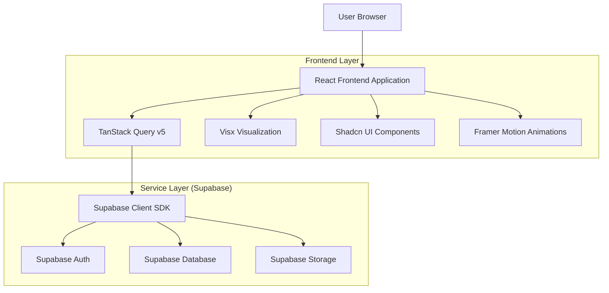
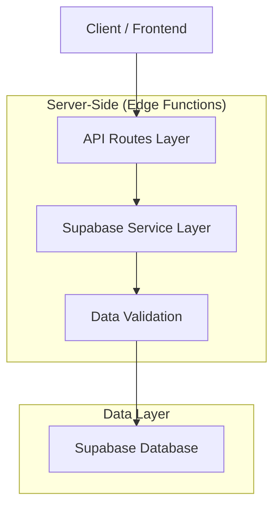
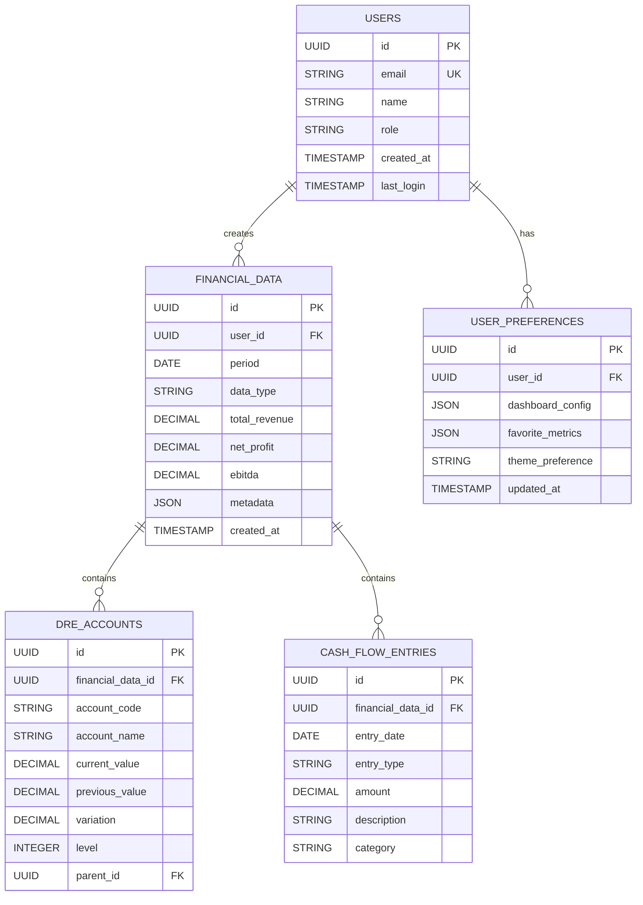

## 1. Architecture design



## 2. Technology Description

- **Frontend**: React@18 + TypeScript@5 + Vite@5
- **Styling**: Tailwind CSS v3 + tailwindcss-animate
- **Componentes UI**: Shadcn UI (Radix UI based)
- **Visualização de Dados**: Visx (Airbnb) + Observable Plot + D3.js
- **Gerenciamento de Estado**: TanStack Query v5 (React Query)
- **Backend/Banco**: Supabase (PostgreSQL + Auth + Storage)
- **Roteamento**: React Router DOM v6
- **Ícones**: Lucide React
- **Animações**: Framer Motion
- **Initialization Tool**: vite-init

## 3. Route definitions

| Route | Purpose |
|-------|---------|
| / | Dashboard Master - Homepage com indicadores gerais |
| /dre | Dashboard DRE - Demonstração de Resultados detalhada |
| /cash-flow | Dashboard Fluxo de Caixa - Análise de caixa e projeções |
| /login | Página de autenticação com Supabase |
| /profile | Perfil do usuário e preferências |

## 4. API definitions

### 4.1 Financial Data APIs

```
GET /api/financial/master-metrics
```

Response:
```json
{
  "total_revenue": 1250000.00,
  "net_profit": 285000.00,
  "ebitda": 425000.00,
  "revenue_growth": 15.3,
  "profit_margin": 22.8,
  "period": "2024-03"
}
```

```
GET /api/financial/dre-statement
```

Response:
```json
{
  "accounts": [
    {
      "account_code": "3.01",
      "account_name": "Receita de Vendas",
      "current_value": 1250000.00,
      "previous_value": 1085000.00,
      "variation": 15.3,
      "level": 1
    }
  ],
  "total_period": "2024-03"
}
```

```
GET /api/financial/cash-flow
```

Response:
```json
{
  "cash_position": 850000.00,
  "projections": [
    {
      "date": "2024-04",
      "inflow": 450000.00,
      "outflow": 380000.00,
      "net_flow": 70000.00
    }
  ],
  "working_capital": {
    "inventory_days": 45,
    "receivables_days": 30,
    "payables_days": 35
  }
}
```

## 5. Server architecture diagram



## 6. Data model

### 6.1 Data model definition



### 6.2 Data Definition Language

**Users Table**
```sql
CREATE TABLE users (
  id UUID PRIMARY KEY DEFAULT gen_random_uuid(),
  email VARCHAR(255) UNIQUE NOT NULL,
  name VARCHAR(100) NOT NULL,
  role VARCHAR(20) DEFAULT 'viewer' CHECK (role IN ('viewer', 'analyst', 'executive')),
  created_at TIMESTAMP WITH TIME ZONE DEFAULT NOW(),
  last_login TIMESTAMP WITH TIME ZONE,
  CONSTRAINT users_email_key UNIQUE (email)
);

-- Enable RLS
ALTER TABLE users ENABLE ROW LEVEL SECURITY;

-- Policies
CREATE POLICY "Users can view own profile" ON users FOR SELECT USING (auth.uid() = id);
CREATE POLICY "Users can update own profile" ON users FOR UPDATE USING (auth.uid() = id);
```

**Financial Data Table**
```sql
CREATE TABLE financial_data (
  id UUID PRIMARY KEY DEFAULT gen_random_uuid(),
  user_id UUID NOT NULL REFERENCES users(id),
  period DATE NOT NULL,
  data_type VARCHAR(20) NOT NULL CHECK (data_type IN ('master', 'dre', 'cash_flow')),
  total_revenue DECIMAL(15,2),
  net_profit DECIMAL(15,2),
  ebitda DECIMAL(15,2),
  metadata JSONB DEFAULT '{}',
  created_at TIMESTAMP WITH TIME ZONE DEFAULT NOW(),
  CONSTRAINT financial_data_unique_period UNIQUE (user_id, period, data_type)
);

-- Indexes
CREATE INDEX idx_financial_data_user_period ON financial_data(user_id, period DESC);
CREATE INDEX idx_financial_data_type ON financial_data(data_type);

-- RLS Policies
ALTER TABLE financial_data ENABLE ROW LEVEL SECURITY;
CREATE POLICY "Users can view own financial data" ON financial_data FOR SELECT USING (auth.uid() = user_id);
CREATE POLICY "Analysts can insert financial data" ON financial_data FOR INSERT WITH CHECK (auth.uid() = user_id);
```

**DRE Accounts Table**
```sql
CREATE TABLE dre_accounts (
  id UUID PRIMARY KEY DEFAULT gen_random_uuid(),
  financial_data_id UUID NOT NULL REFERENCES financial_data(id),
  account_code VARCHAR(10) NOT NULL,
  account_name VARCHAR(100) NOT NULL,
  current_value DECIMAL(15,2) NOT NULL,
  previous_value DECIMAL(15,2),
  variation DECIMAL(5,2),
  level INTEGER NOT NULL CHECK (level BETWEEN 1 AND 5),
  parent_id UUID REFERENCES dre_accounts(id),
  created_at TIMESTAMP WITH TIME ZONE DEFAULT NOW()
);

-- Indexes
CREATE INDEX idx_dre_accounts_financial_data ON dre_accounts(financial_data_id);
CREATE INDEX idx_dre_accounts_level ON dre_accounts(level);

-- Grant permissions
GRANT SELECT ON dre_accounts TO anon;
GRANT ALL PRIVILEGES ON dre_accounts TO authenticated;
```

**Sample Data Insertion**
```sql
-- Sample user
INSERT INTO users (email, name, role) VALUES 
('executive@rodoviasul.com', 'Carlos Silva', 'executive');

-- Sample financial data
INSERT INTO financial_data (user_id, period, data_type, total_revenue, net_profit, ebitda) VALUES 
((SELECT id FROM users WHERE email = 'executive@rodoviasul.com'), '2024-03-01', 'master', 1250000.00, 285000.00, 425000.00);

-- Sample DRE accounts
INSERT INTO dre_accounts (financial_data_id, account_code, account_name, current_value, previous_value, variation, level) VALUES
((SELECT id FROM financial_data WHERE period = '2024-03-01' AND data_type = 'master'), '3.01', 'Receita de Vendas', 1250000.00, 1085000.00, 15.3, 1),
((SELECT id FROM financial_data WHERE period = '2024-03-01' AND data_type = 'master'), '3.02', 'Custo dos Produtos', -875000.00, -780000.00, -12.2, 1);
```