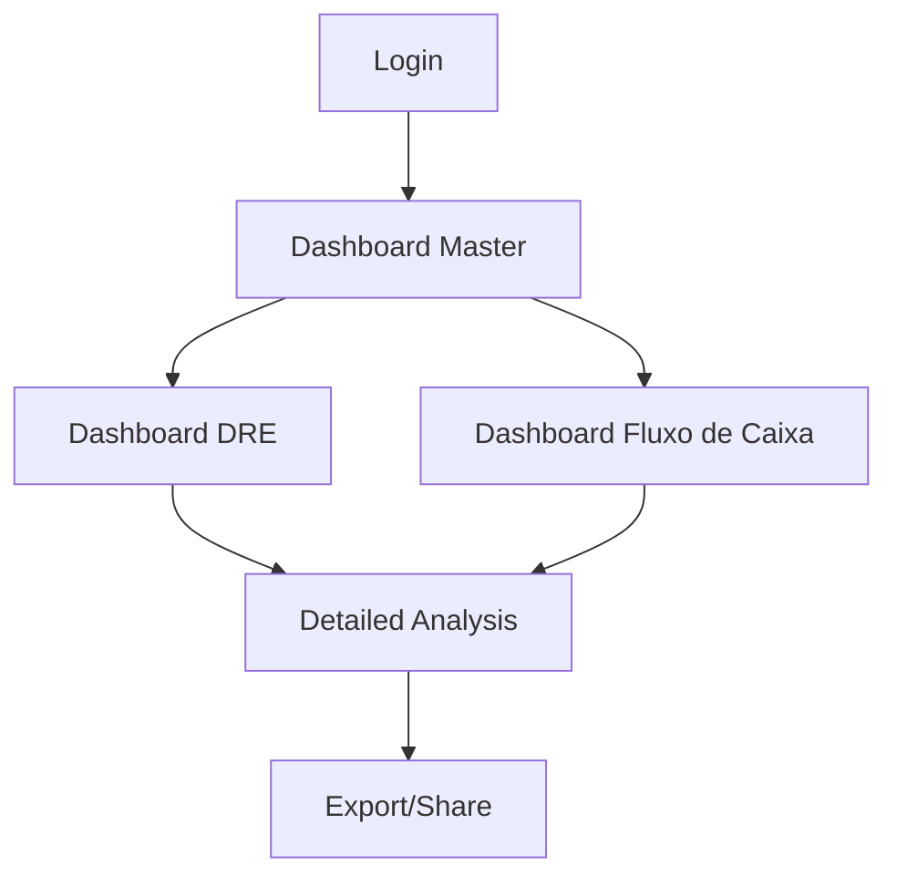

## 1. Product Overview

Dashboard financeiro premium com storytelling de dados e visual editorial inspirado em NYT/Financial Times. Sistema de alta fidelidade visual que transforma dados financeiros em narrativas visuais cativantes para tomada de decisão executiva.

Problema: Dashboards financeiros tradicionais são genéricos e não comunicam insights de forma envolvente. Solução: Interface editorial que conta histórias com dados, usando visualização customizada e design jornalístico para engajar executivos.

## 2. Core Features

### 2.1 User Roles

| Role | Registration Method | Core Permissions |
|------|---------------------|------------------|
| Executive User | Supabase email auth | Full dashboard access, all financial modules |
| Financial Analyst | Supabase email auth | View all data, export reports, filter analysis |
| View Only User | Supabase email auth | Read-only access, basic filtering |

### 2.2 Feature Module

O dashboard financeiro editorial consiste nos seguintes módulos principais:

1. **Dashboard Master**: Indicadores gerais de performance com manchetes dramáticas e métricas principais
2. **Dashboard DRE**: Demonstração de Resultados com visualização editorial detalhada e análises de tendência
3. **Dashboard Fluxo de Caixa**: Análise de fluxo de caixa com projeções e cenários visuais

### 2.3 Page Details

| Page Name | Module Name | Feature description |
|-----------|-------------|---------------------|
| Dashboard Master | Hero Metrics | Display receita total, lucro líquido, EBITDA em números grandes e dramáticos com variação percentual |
| Dashboard Master | Performance Race | Visualização "corrida" entre unidades de negócio usando gráfico de barras animado com Visx |
| Dashboard Master | Revenue Evolution | Gráfico de linha/área mostrando evolução da receita vs meta com anotações contextuais |
| Dashboard Master | Quick Filters | Barra de filtros superior (período, unidade, produto) que atualiza toda a página via URL state |
| Dashboard DRE | Income Statement | Tabela DRE interativa com drill-down por conta e visualização de variações interanuais |
| Dashboard DRE | Margin Analysis | Gráficos de margem (bruta, EBITDA, líquida) com benchmark setorial e tendências |
| Dashboard DRE | Cost Breakdown | Visualização hierárquica de custos usando gráfico de sunburst customizado |
| Dashboard Fluxo de Caixa | Cash Flow Timeline | Timeline visual de entrada/saída de caixa com projeções futuras e cenários |
| Dashboard Fluxo de Caixa | Working Capital | Análise de giro de capital de giro com dias de estoque, recebíveis e pagáveis |
| Dashboard Fluxo de Caixa | Cash Position | Indicador de posição de caixa com zonas de alerta (verde/amarelo/vermelho) |

## 3. Core Process

**Executive Flow**: Usuário faz login → Visualiza Dashboard Master com métricas principais → Usa filtros para explorar diferentes períodos → Navega para DRE para análise detalhada → Verifica Fluxo de Caixa para gestão operacional → Clica em elementos para ver detalhes no Sheet lateral

**Analyst Flow**: Acesso aos três dashboards → Aplica filtros avançados → Exporta dados específicos → Compartilha insights via links com filtros pré-aplicados

## 4. User Interface Design

### 4.1 Design Style

- **Cores Primárias**: #24AC84 (verde principal), #D9D9D9 (cinza claro), #FCFCFC (quase branco)
- **Cores de Destaque**: #FAC017 (dourado para metas atingidas), vermelho para negativo
- **Tipografia**: 
  - Números: JetBrains Mono (tabular, precisão)
  - Títulos: Lora (serifa, tom editorial)
  - UI: Inter (limpeza e legibilidade)
- **Estilo de Botões**: Minimalistas com bordas sutis, hover states elegantes
- **Layout**: Hierarquia editorial com 3 níveis (manchete → contexto → detalhe)
- **Ícones**: Lucide React com peso consistente

### 4.2 Page Design Overview

| Page Name | Module Name | UI Elements |
|-----------|-------------|-------------|
| Dashboard Master | Hero Metrics | Números gigantes (72px+) com variações coloridas, layout tipo manchete de jornal |
| Dashboard Master | Performance Race | Gráfico de barras horizontal animado, cores por performance, labels minimalistas |
| Dashboard DRE | Income Statement | Tabela zebra com hover states, coluna de variação com setas coloridas |
| Dashboard Fluxo de Caixa | Cash Timeline | Gráfico de área empilhada com gradientes suaves, linhas de projeção tracejadas |

### 4.3 Responsiveness

Desktop-first otimizado para telas grandes (1920x1080+), com adaptação para tablets. Mobile simplificado focando apenas nos indicadores principais. Layout pensado para TVs de dashboards corporativos.

### 4.4 3D Scene Guidance

Não aplicável - este é um dashboard 2D com visualização de dados plana.